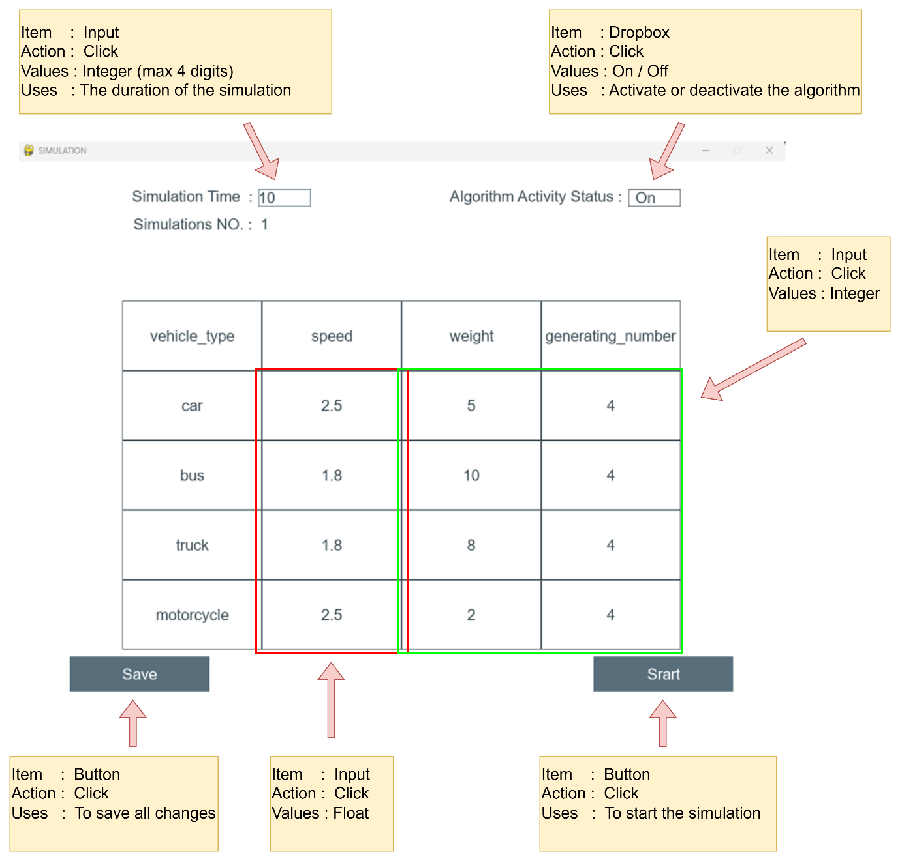
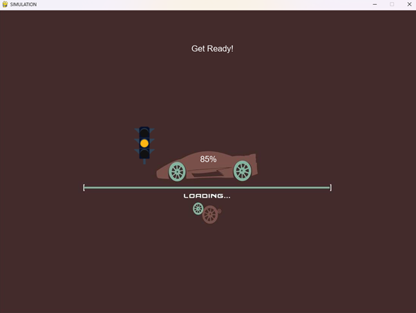
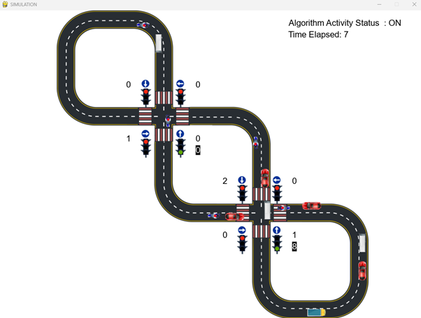
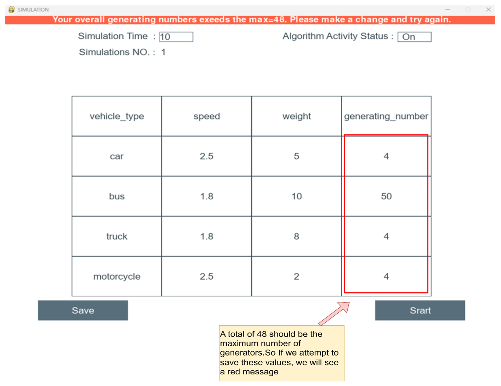
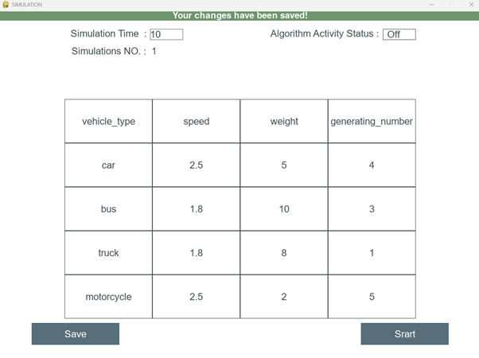
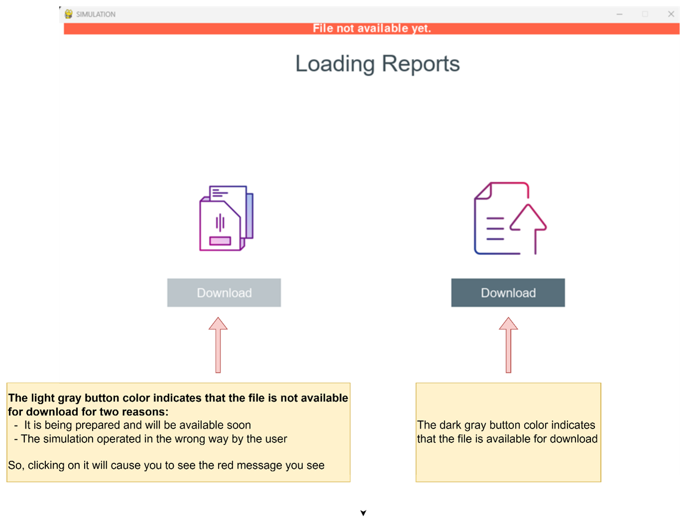
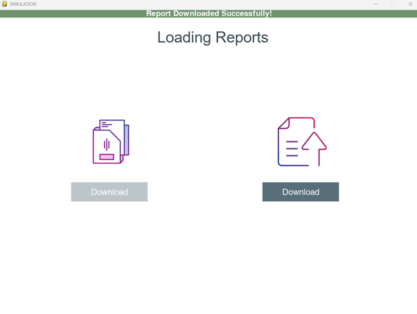
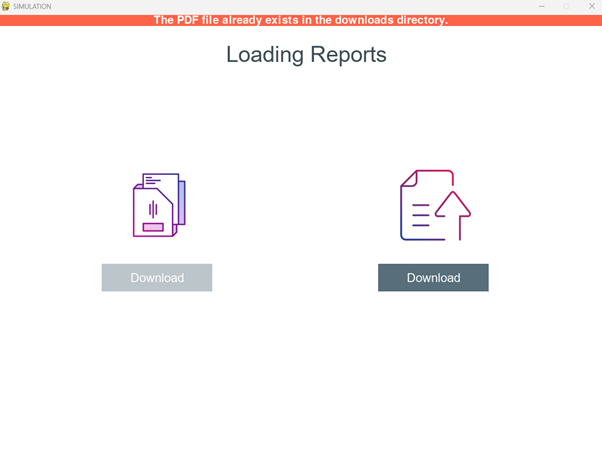

<h1 align="center">Prioritize The Passage of Vehicles at Intersections According to Fuel Consumption</h1>

<div align="center">

[](https://www.python.org/downloads/release/python-370/)
[](https://www.apache.org/licenses/LICENSE-2.0)
</div>

 

#### This project deals with the case of a smart intersection, where several vehicles approach the intersection from various directions, and a smart traffic light must decide  which traffic signal takes the green light, based not only on the number of vehicles in each lane but also on other factors such as the weight and type of vehicles (e.g. emergency vehicles).


-----------------------------------------
## Inspiration

* Traffic congestion is becoming one of the critical issues with the increasing population and automobiles in cities. Traffic jams not only cause extra delay and stress for the drivers but also increase fuel consumption and air pollution. 

* The Project goal is to prioritize the passage of vehicles at intersections according to fuel consumption, which aims to offer a solution for saving fuel by giving priority at traffic light intersections to heavier vehicles. Those vehicles’ priorities will be gleaned from technologies that can identify the type of the vehicle and give it a priority according to the priorities table that we built. 

------------------------------------------
## Implementation Details

This project can be broken down into 3 modules:

1. `Vehicle Detection Module` - This module is responsible for detecting the number of vehicles in the data that received as input from the Waze application. More specifically, it will provide as output the number of vehicles of each vehicle class such as car, bike, bus and truck.

2. `Signal Switching Algorithm` - This algorithm updates the red, green, and yellow times of all signals. These timers are set bases on several factors such as the number of lanes, minimum overall weight of vehicles that detected on the lane, etc. 

3. `Simulation Module` - A simulation is developed from scratch using [Pygame](https://www.pygame.org/news) library to simulate traffic signals and vehicles moving across a traffic intersections.


------------------------------------------
##  Instructions

* ### Main Screen
Here as you can see in the picture the user has the ability to choose all the factors before start running the system.

Several factors such as:

> Speed, weight for each type.

>Number of vehicles for each type.

> Running time for the system.

> Apply the smart intersection algorithm that we’ve developed or keep it as normal intersection.

Choose program factors and Press the button “Save” in order to update all the values before start running the program.

<p align="center">
 
</p>

<br> 

*  Press the button “Start” to run the program, and wait for the program to generate the vehicles with the factors you chose.


<p align="center">
 
</p>

<br> 

* Enjoy watching the program running based on the data that you’ve entered, the program will finish running after the “Simulation Time” that you entered(secs)

<p align="center">
 
</p>

<br> 

* The program will automatically build a report file based on the results that the program calculated during the run, you can download the report on your PC and here you have all the data you wanted to see.

<p align="center">
 
</p>

<br> 

------------------------------------------
## GUI Tests


* Maximizing the number of vehicles that can be generated by the simulation by generating more than the maximum number.

<p align="center">
 
</p>

<br> 

* Checking the data is legal and has been successfully saved at the correct location after clicking the Save button.

<p align="center">
 
</p>

<br> 

* Attempting to download an unavailable file

<p align="center">
 
</p>

<br> 

* Attempting  to download the report from the right side, by clicking on the Download button after checking if it is available and it hasn't been downloaded previously.

<p align="center">
 
</p>

<br> 

* Downloading the report after it has been downloaded

<p align="center">
 
</p>

<br> 

------------------------------------------
## Conclusions
In our research, we proposed a new solution for making traffic signals smarter using detection technologies such as GPS to detect the location, weight, and speed of vehicles. We developed an algorithm that utilizes this data to give priority to heavier vehicles at intersections. Our goals were to reduce traffic jams, fuel consumption, and save time and money. The main success factor was to increase the average speed of each vehicle after implementing our solution.

The results we achieved were:
* Increased average speed of each vehicle by X% (comparing before and after)

* Fewer traffic jams

Overall, our smart traffic light system shows promise in improving the efficiency and sustainability of traffic management at intersections, with benefits for both individual vehicle owners and society as a whole.

------------------------------------------
## Prerequisites

1. [Python 3.7](https://www.python.org/downloads/release/python-370/)
2. [Visual Studio Code](https://code.visualstudio.com/) 

------------------------------------------
## Installation

* Step I : Clone the Repository
```sh
      $ git clone https://github.com/RashedKewan/Intersection-Prioritization.git
```

* Step II : Download Extensions & Libraries
```sh
      # Open Terminal(Ex: Git Bash)
      # Change the permissions of the file
      $ chmod 755 set_up.sh
      # Execute the script
      ./set_up.sh
```

* Step III : Clone the Repository
```sh
      # To run simulation
      $ python main.py
```

------------------------------------------
## Contributors

Rashed Kewan - [Github](https://github.com/RashedKewan)

Ibrahim Qassem - [Github](https://github.com/ibrapr)

------------------------------------------
## Acknowledgement

We would like to extend our sincere thanks to our Supervisor Mr. Ronen Zilber for his kind help and valuable advice. His support and constant supervision were imperative for the successful completion of this project. 

------------------------------------------
## License
This project is licensed under the Apache License 2.0 
