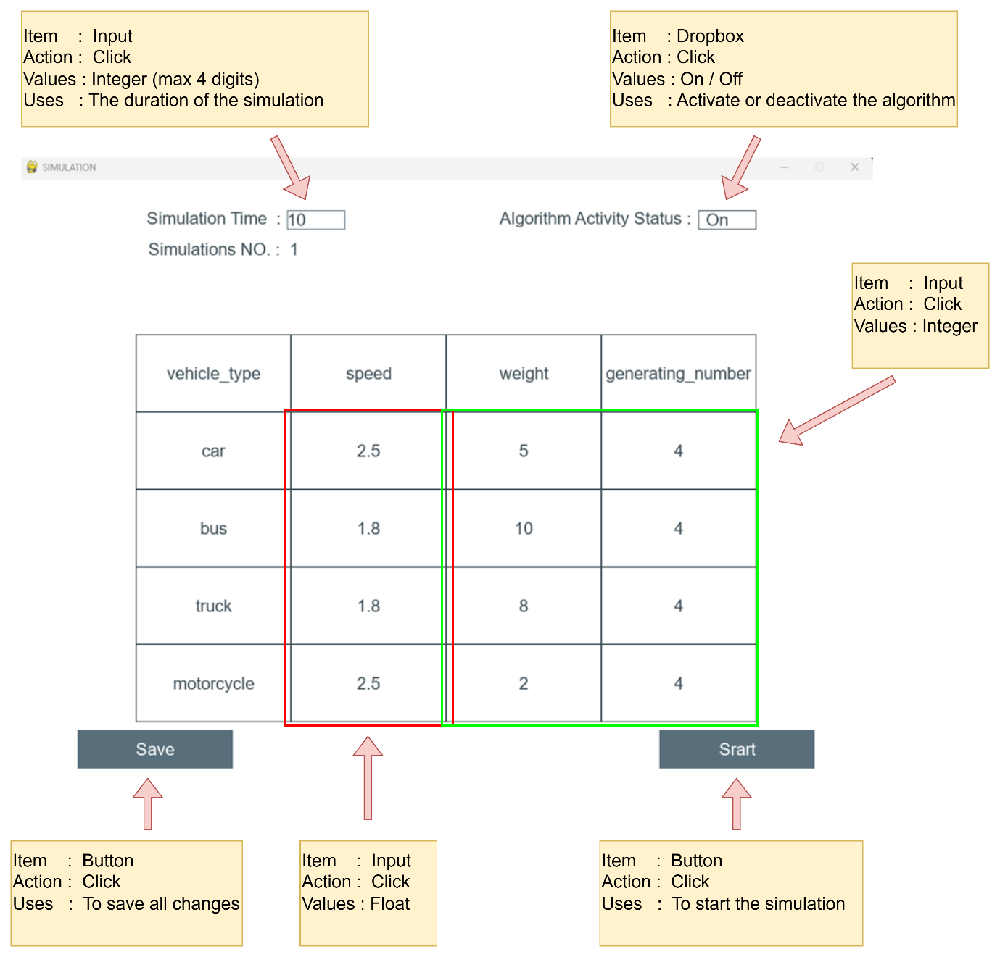
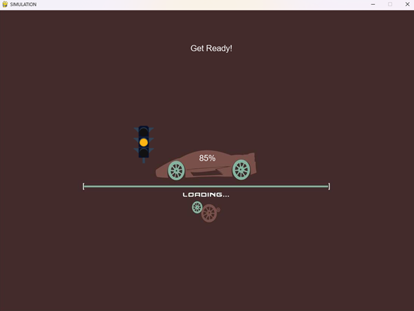
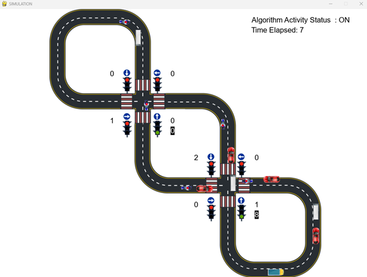
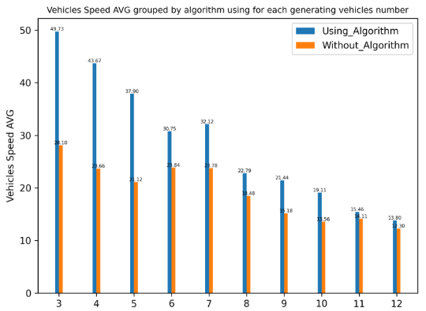
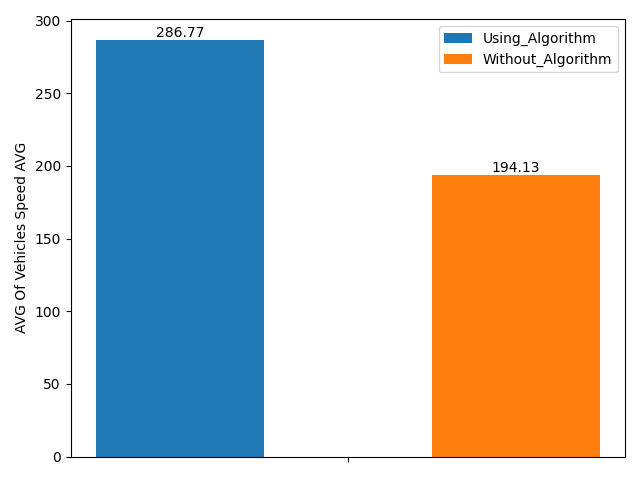

<h1 align="center">Prioritize The Passage of Vehicles at Intersections According to Fuel Consumption</h1>

<div align="center">

[](https://www.python.org/downloads/release/python-370/)
[](https://www.apache.org/licenses/LICENSE-2.0)
</div>

 

#### This study presents a smart traffic light system for prioritizing the passage of vehicles at intersections based on fuel consumption and average speed. The system uses detection technologies such as GPS and RF signals to identify the type and number of vehicles approaching the intersection, and assigns priorities to the vehicles based on a pre-determined set of criteria. The goal of the system is to improve the average speed of vehicles by applying the algorithm functionality and utilizing relevant technologies such as GPS, if needed. This is expected to lead to a more efficient transportation system with reduced delays and fuel consumption. The system also has the potential to improve safety at intersections by prioritizing the passage of emergency vehicles. Overall, the smart traffic light system has the potential to significantly improve the efficiency and sustainability of traffic management at intersections, with benefits for both individual vehicle owners and society as a whole.


-----------------------------------------
## Inspiration

* Traffic congestion is becoming one of the critical issues with the increasing population and automobiles in cities. Traffic jams not only cause extra delay and stress for the drivers but also increase fuel consumption and air pollution. 

* The Project goal is to prioritize the passage of vehicles at intersections according to fuel consumption, which aims to offer a solution for saving fuel by giving priority at traffic light intersections to heavier vehicles. Those vehicles’ priorities will be gleaned from technologies that can identify the type of the vehicle and give it a priority according to the priorities table that we built. 

------------------------------------------
## Implementation Details

This project can be broken down into 3 modules:

1. `Vehicle Detection Module` - This module is responsible for detecting the number of vehicles in the data that received as input from the Waze application. More specifically, it will provide as output the number of vehicles of each vehicle class such as car, bike, bus and truck.

2. `Signal Switching Algorithm` - This algorithm updates the red, green, and yellow times of all signals. These timers are set bases on several factors such as the number of lanes, minimum overall weight of vehicles that detected on the lane, etc. 

3. `Simulation Module` - A simulation is developed from scratch using [Pygame](https://www.pygame.org/news) library to simulate traffic signals and vehicles moving across a traffic intersections.


------------------------------------------
##  Instructions


* ### Main Screen
Here as you can see in the picture the user has the ability to choose all the factors before start running the system.

Several factors such as:

> Speed, weight for each type.

>Number of vehicles for each type.

> Running time for the system.

> Apply the smart intersection algorithm that we’ve developed or keep it as normal intersection.

Choose program factors and Press the button “Save” in order to update all the values before start running the program.

<p align="center">
 
</p>

<br> 

*  Press the button “Start” to run the program, and wait for the program to generate the vehicles with the factors you chose.


<p align="center">
 
</p>

<br> 

* Enjoy watching the program running based on the data that you’ve entered, the program will finish running after the “Simulation Time” that you entered(secs)

<p align="center">
 
</p>

<br> 

* * The file on the left will show the comparison between different inputs, using graph that shows the relation between the number of vehicles for each type and the average speed during the run. In addition, it also compares the runs with and without using the algorithm.
  * The program will automatically build a report file based on the results that the program calculated during the run, you can download the report on your PC and here you have all the data you wanted to see.

  * The file on the left is only available to download when you want to compare different inputs, like : different vehicles numbers, use the algorithm or not etc..


<p align="center">
 
</p>

<br>

*  The file will be downloaded to your PC's download directory when you click the download button. 
------------------------------------------
## Algorithm and Pseudocode

**Input  :** *Queues of lanes’ vehicles ( each lane has a queue of vehicles )*

**Output :** *The next green lane that has the maximum weight*


> *Algorithm  ( queues[ ] ) :*       

> 1. *weights  &larr; [ ]*
> 1. *for  queue  in  queues[ ] :*
>    1. *weight &larr; calculate_weight( queue )*
>    1. *append weight to weights*
> 1. *max_weight &larr; max( weights )*
> 1. *if max_weight equals 0 :*
>    1. *next_green &larr; next signal ( clockwise )* 
> 1. *else :*
>    1. *next_green &larr; number of the lane that has max_weight*
> 1. *return next_green*
  

------------------------------------------

## Results
We conducted simulations using various input sizes, including scenarios with 3 and 12 vehicles of each type, both with and without using the algorithm. The simulation time for each scenario was 30 seconds. The comparison between these scenarios is shown in a graph, the details of which are described in the preceding text.

<p align="center">
 
</p>

In most cases, our algorithm resulted in a significant improvement in average speed. However, in situations where the road was heavily congested, the average speed may not have improved as much. For example, in the scenario with 12 vehicles of each type, there was not a significant improvement. Despite this, our algorithm consistently performed at least as well as the regular algorithm in the worst-case scenario."

------------------------------------------
## Conclusions
In our research, we proposed a new solution for making traffic signals smarter using detection technologies such as GPS to detect vehicle location, weight, and speed. We developed an algorithm that utilizes this data to give priority to heavier vehicles at intersections. Our goals were to reduce traffic jams, and fuel consumption, and save time and money. After implementing our solution, the main success factor was increasing each vehicle’s average speed.

The results we achieved:
<p align="center">
 
</p>
Boosting average speed by 47% in AVG.

As a result, it leads to:

* Reduction in traffic congestion

* Decrease in fuel consumption

Overall, our smart traffic light system shows promise in improving the efficiency and sustainability of traffic management at intersections, with benefits for both individual vehicle owners and society as a whole.


------------------------------------------
## Prerequisites

1. [Python 3.7](https://www.python.org/downloads/release/python-370/)
2. [Visual Studio Code](https://code.visualstudio.com/) 

------------------------------------------
## Installation

* Step I : Clone the Repository
```sh
      git clone https://github.com/RashedKewan/Intersection-Prioritization.git
```

* Step II : Download Extensions & Libraries
```sh
      # Open Terminal(Ex: Git Bash)
      # Get Inside The Directory
      cd Intersection-Prioritization
      # Execute the script
      ./set_up.sh
```

* Step III : Run Simulation
```sh
     
      python main.py
```

------------------------------------------
## Contributors

Rashed Kewan - [Github](https://github.com/RashedKewan)

Ibrahim Qassem - [Github](https://github.com/ibrapr)

------------------------------------------
## Acknowledgement

We would like to extend our sincere thanks to our Supervisor Mr. Ronen Zilber for his kind help and valuable advice. His support and constant supervision were imperative for the successful completion of this project. 

------------------------------------------
## License
This project is licensed under the Apache License 2.0 
