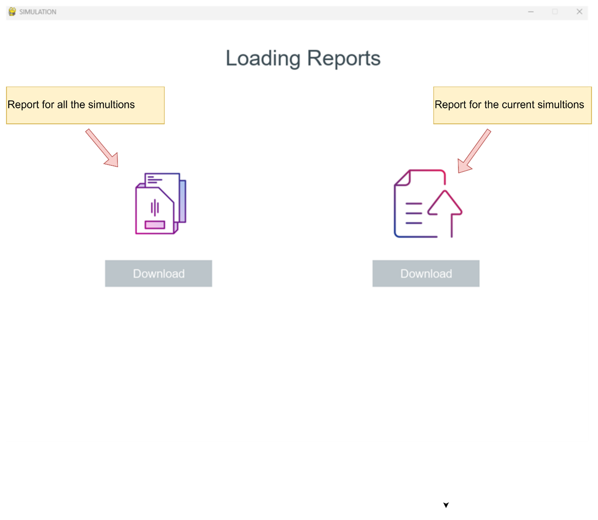

<h1 align="center">Prioritize The Passage of Vehicles at Intersections According to Fuel Consumption</h1>

<div align="center">

[](https://www.python.org/downloads/release/python-370/)
[](https://www.apache.org/licenses/LICENSE-2.0)
</div>

 

#### This project deals with the case of a smart intersection, where several vehicles approach the intersection from various directions, and a smart traffic light must decide  which traffic signal takes the green light, based not only on the number of vehicles in each lane but also on other factors such as the weight and type of vehicles (e.g. emergency vehicles).


-----------------------------------------
## Inspiration

* Traffic congestion is becoming one of the critical issues with the increasing population and automobiles in cities. Traffic jams not only cause extra delay and stress for the drivers but also increase fuel consumption and air pollution. 

* The Project goal is to prioritize the passage of vehicles at intersections according to fuel consumption, which aims to offer a solution for saving fuel by giving priority at traffic light intersections to heavier vehicles. Those vehicles’ priorities will be gleaned from technologies that can identify the type of the vehicle and give it a priority according to the priorities table that we built. 

------------------------------------------
## Implementation Details

This project can be broken down into 3 modules:

1. `Vehicle Detection Module` - This module is responsible for detecting the number of vehicles in the data that received as input from the Waze application. More specifically, it will provide as output the number of vehicles of each vehicle class such as car, bike, bus and truck.

2. `Signal Switching Algorithm` - This algorithm updates the red, green, and yellow times of all signals. These timers are set bases on several factors such as the number of lanes, minimum overall weight of vehicles that detected on the lane, etc. 

3. `Simulation Module` - A simulation is developed from scratch using [Pygame](https://www.pygame.org/news) library to simulate traffic signals and vehicles moving across a traffic intersections.

Read more about object detection model used, working of the algorithm, and development of simulation [here](./Adaptive_Traffic_Signal_Timer_Implementation_Details.pdf).

------------------------------------------
## Application Scenes

* `Vehicle Detection`

<p align="center">
 
</p>

<br> 

* `Vehicle Detection`

<p align="center">
 
</p>

<br> 

* `Vehicle Detection`

<p align="center">
 
</p>

<br> 

* `Vehicle Detection`

<p align="center">
 
</p>

<br> 

------------------------------------------
## Tests


* `Maximizing the number of vehicles that can be generated by the simulation by generating more than the maximum number.`

<p align="center">
 
</p>

<br> 

* `Checking the data is legal and has been successfully saved at the correct location after clicking the Save button.`

<p align="center">
 
</p>

<br> 

* `Attempting to download an unavailable file`

<p align="center">
 
</p>

<br> 

* `Attempting  to download the report from the right side, by clicking on the Download button after checking if it is available and it hasn't been downloaded previously.`

<p align="center">
 
</p>

<br> 

* `Downloading the report after it has been downloaded`

<p align="center">
 
</p>

<br> 

------------------------------------------
## Prerequisites

1. [Python 3.7](https://www.python.org/downloads/release/python-370/)
2. [Visual Studio Code](https://code.visualstudio.com/) 

------------------------------------------
## Installation

* Step I : Clone the Repository
```sh
      $ git clone 
```

* Step II : Download Extensions
```
1- Open **extensions.txt** file that contains extensions id

2- Browse for extensions:
   You can browse and install extensions from within VS Code. Bring up the Extensions 
   view by clicking on the Extensions icon in the Activity Bar on the side of VS Code or 
   the View: Extensions command (Ctrl+Shift+X).

3- serch for each id from **extensions.txt** & install it.
```


* Step III : Install Libraries
```sh
      $ python install_libraries.py
```

* Step IV : Clone the Repository
```sh
      # To run simulation
      $ python main.py
```

------------------------------------------
## Contributors

Rashed Kewan - [Github](https://github.com/RashedKewan)

Ibrahim Qassem - [Github](https://github.com/ibrapr)

------------------------------------------
## Acknowledgement

We would like to extend our sincere thanks to our Supervisor Mr. Ronen Zilber for his kind help and valuable advice. His support and constant supervision were imperative for the successful completion of this project. 

------------------------------------------
## License
This project is licensed under the Apache License 2.0 - see the [LICENSE](./LICENSE) file for details.