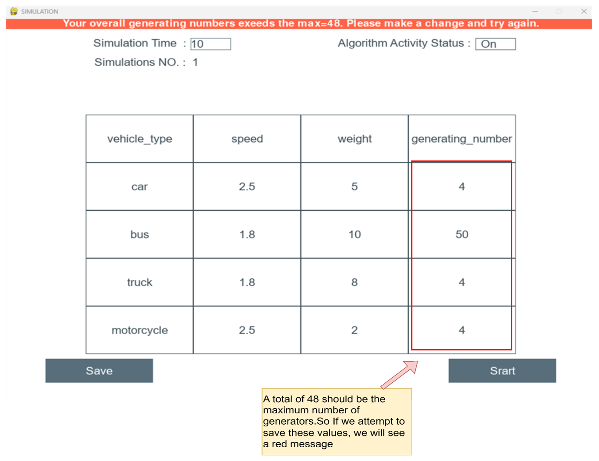
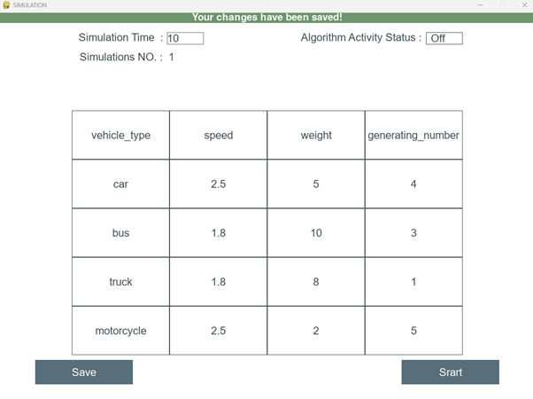
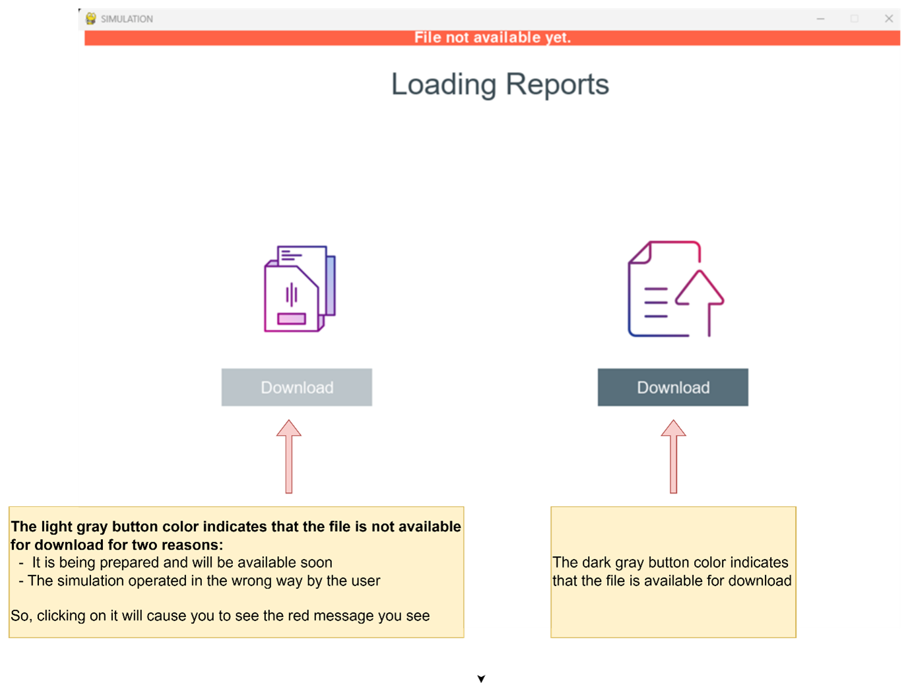
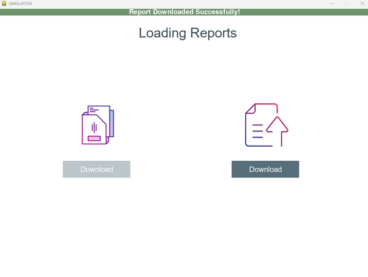
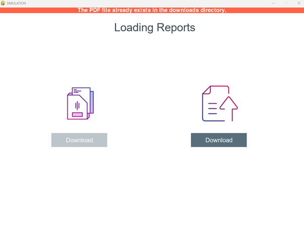

------------------------------------------
## GUI Tests

* Maximizing the number of vehicles that can be generated by the simulation by generating more than the maximum number.

 

  

* Checking the data is legal and has been successfully saved at the correct location after clicking the Save button.

 

  

* Attempting to download an unavailable file

  

  

* Attempting  to download the report from the right side, by clicking on the Download button after checking if it is available and it hasn't been downloaded previously.

 

  

* Downloading the report after it has been downloaded

 

  

------------------------------------------